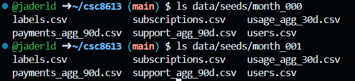
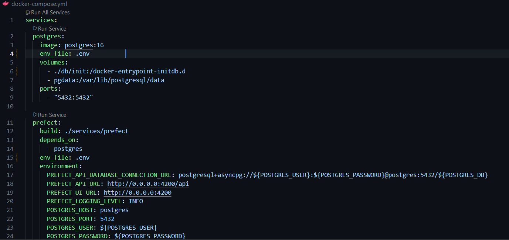

# Rapport TP2 — StreamFlow  
**Pipeline d’ingestion, validation et snapshots**

## Exercice 1

### 1.a
Commande `ls` exécutée à la racine du projet :

### 1.b
Commande `tree` :

### 1.c
Commande `ls data/seeds/month` :

## Exercice 2 : Base de données et docker-compose

### 2.a
Le fichier 001_schema.sql a bien été créé.

### 2.b
Un fichier `.env` est utilisé pour définir les variables d’environnement liées à PostgreSQL. Il permet d’éviter de stocker des identifiants en dur dans le code et de faciliter la configuration du projet.

### 2.c

### 2.d

## Exercice 3 - Upsert des CSV avec Prefect

### 3.a
Prefect est utilisé pour orchestrer les différentes étapes du pipeline de données. Il permet de structurer le pipeline en tâches distinctes, de contrôler l’ordre d’exécution et de préparer l’ajout de validations.

### 3.b
L’ingestion des données repose sur une stratégie d’upsert : les données sont d’abord chargées depuis les fichiers CSV puis elles sont insérées dans les tables PostgreSQL. En cas de conflit sur la clé primaire, les lignes existantes sont mises à jour.

Cette approche garantit l’idempotence du pipeline, l’absence de doublons et la possibilité de rejouer une ingestion.

### 3.c

On obtient donc 7043 clients.

## Exercice 4 - Validation des données avec Great Expectations

### 4.a
Les règles de validation permettent de vérifier la présence des colonnes attendues et d’empêcher l’ingestion de valeurs incohérentes.
Cette validation agit comme une barrière avant toute exploitation des données.

### 4.c
Après l’ingestion des fichiers CSV et leur insertion dans PostgreSQL, le pipeline exécute systématiquement des règles de validation avant toute création de snapshot :

- `validate_with_ge("users")`
- `validate_with_ge("subscriptions")`
- `validate_with_ge("usage_agg_30d")`
 
Par exemple, pour la table `subscriptions`, le code impose :
- une correspondance stricte du schéma (`expect_table_columns_to_match_set`) ;
- l’absence de valeurs nulles sur la clé métier `user_id` ;
- des bornes minimales sur des variables numériques critiques, comme :
  - `months_active >= 0`
  - `monthly_fee >= 0`.

Pour la table `usage_agg_30d`, toutes les métriques d’usage sont contraintes à être positives ou nulles :
- `watch_hours_30d >= 0`
- `avg_session_mins_7d >= 0`
- `unique_devices_30d >= 0`
- `skips_7d >= 0`
- `rebuffer_events_7d >= 0`.
 
Ces règles permettent d’empêcher la propagation de données incohérentes et de protéger les étapes ultérieures, notamment l’entraînement de modèles de machine learning.

## Exercice 5 - Snapshots et ingestion month_001

### 5.a
La fonction `snapshot_month(as_of)` crée des tables de snapshots mensuels et y copie l’état des tables live à une date donnée.  
Le paramètre `as_of` permet de figer les données telles qu’elles étaient à la fin d’un mois précis, en ajoutant une dimension temporelle aux features et en garantissant la reproductibilité des analyses.

### 5.b

On obtient le même nombre de lignes.

### 5.c
### Pourquoi ne pas utiliser les tables live pour l’entraînement ?
Les tables live évoluent continuellement, ce qui rendrait les résultats non reproductibles.

### Importance des snapshots

Les snapshots garantissent la reproductibilité des expériences, la cohérence entre features et labels, ainsi qu'une meilleure traçabilité des données.

### Difficultés rencontrées
## Erreurs rencontrées et corrections
Complétion des snapshots (payments_agg_90d_snapshots)
- Le bloc d’insertion pour payments_agg_90d_snapshots était incomplet.
Pour cause, la copie des autres blocs s'est faite sans adaptation de la colonne spécifique failed_payments_90d.

- Validation Great Expectations
Symptôme : Lors de l’ajout des expectations pour usage_agg_30d, il fallait compléter la liste exacte des colonnes. Quand j'oubliais quelque chose, les expectations initiales étaient partielles et la fonction validate_with_ge levait une exception si elles échouaient.