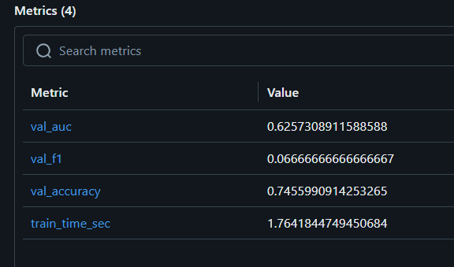
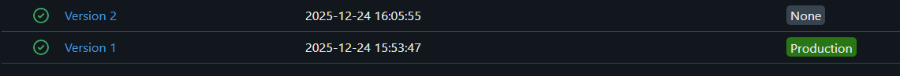
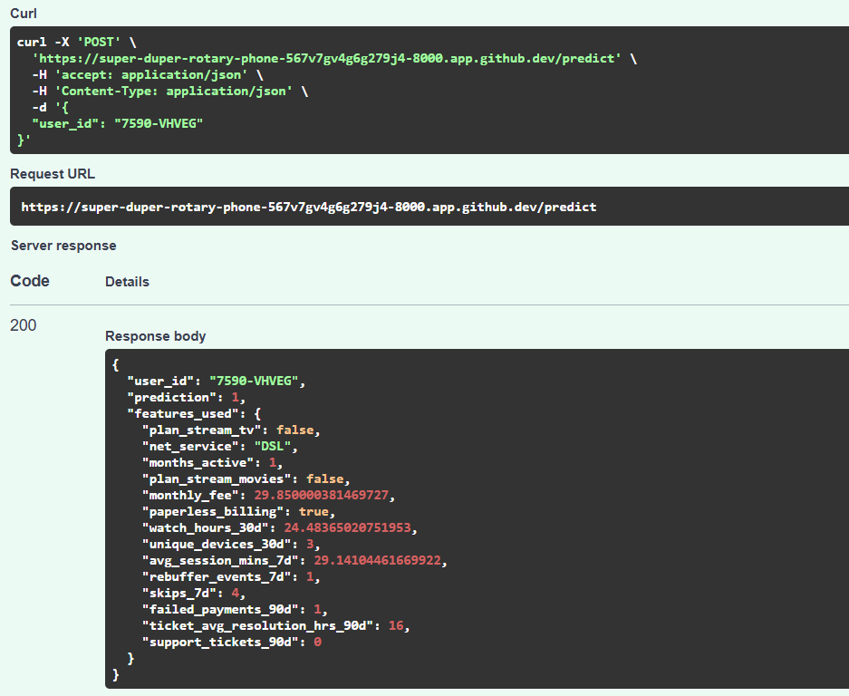

## Exercice 1 - Mise en route

Tous les composants principaux de la stack tournent correctement :

- **API** : service backend exposant l’endpoint `/health` et `/features/{user_id}` pour interagir avec Feast et la base Postgres.
- **Postgres** : base de données contenant les snapshots et labels.
- **Feast** : gestion des features offline et online.
- **MLflow** : serveur de tracking et Model Registry pour enregistrer les runs et modèles.

Cette configuration garantit que le pipeline MLOps est complet : ingestion de données, extraction de features, entraînement et suivi des modèles, avec accès web pour MLflow et endpoints REST pour l’API.

## Exercice 2 - Créer un script d'entraînement

### 2.b

### 2.c
- **AS_OF utilisé** : `2024-01-31`
- **Colonnes catégorielles détectées** : `net_service`

- **Métriques sur le jeu de validation** :
  - AUC : **0.6257**
  - F1-score : **0.0667**
  - Accuracy : **0.7456**
  - Temps d’entraînement : **13 s**

Le script train_baseline.py a été exécuté dans le conteneur Prefect avec la variable d’environnement TRAIN_AS_OF=2024-01-31.
L’entraînement s’est terminé avec succès, générant un run MLflow identifié par le run_id 7bb87d6e19194f25b83ac282fafe1ef9.
Le modèle RandomForest a été enregistré dans le Model Registry sous le nom streamflow_churn.

## Exercice 3 - Explorer l'interface MLflow

Le modèle `streamflow_churn` entraîné lors du run MLflow a été enregistré automatiquement dans le Model Registry.
La dernière version du modèle a été promue vers le stage **Production** via l’interface graphique MLflow.

## Exercice 4 - Etendre l'API pour exposer /predict

Le modèle chargé par l’API doit pointer vers models:/streamflow_churn/Production afin de garantir un déploiement fiable, versionné et traçable. Le Model Registry de MLflow permet de gérer explicitement les transitions entre les stages sans modifier le code. À l’inverse, un fichier local (.pkl) ou un artifact de run dépend d’un chemin non partagé et non versionné. L’utilisation du stage Production garantit que l’API sert toujours le modèle validé et approuvé.

## Exercice 5 - Robustesse du serving

La requête réussie est présente dans la capture d'écran de l'exercice 4.

En serving, plusieurs problèmes peuvent provoquer des prédictions incorrectes ou des erreurs. Une première cause fréquente est l’entité absente, lorsque le user_id demandé n’existe pas dans l’online store ; l’API ne peut alors récupérer aucune feature pour cette entité, et renvoie une erreur. Une deuxième cause est un online store incomplet ou obsolète, par exemple si les données ne sont pas à jour ; cela se traduit par des features manquantes côté API. Ces problèmes peuvent être détectés tôt grâce à des tests automatisés de prédiction ou via l’endpoint /features/{user_id}, qui permet de vérifier que toutes les features nécessaires sont présentes avant de lancer le modèle en production.

## Exercice 6 - Réflexion de synthèse

# 6.a
MLflow garantit la traçabilité complète des entraînements : chaque run est enregistré avec ses paramètres, ses métriques et ses artefacts. On peut ainsi savoir exactement quelles données, quel code et quelle configuration ont produit un modèle donné. Au niveau de l’identification des modèles servis, MLflow permet de référencer un modèle via le Model Registry, en associant un nom unique et des versions à chaque run, ce qui évite toute confusion sur le modèle utilisé en production.

# 6.b
Le stage Production indique à l’API quel modèle utiliser au démarrage : MLflow charge automatiquement la dernière version validée en Production. Cela permet de garantir que seule une version testée et approuvée est servie, et évite de déployer accidentellement un modèle expérimental ou non validé. Cela facilite également les rollbacks vers une version antérieure en Production si nécessaire.

# 6.c
Même avec MLflow, la reproductibilité peut être compromise à plusieurs endroits :

Les données --> si les features utilisées pour l’entraînement changent ou si l’on ne conserve pas un snapshot exact, la prédiction peut diverger.
Le code --> des modifications du code source ou des scripts de préprocessing non versionnés peuvent produire un modèle différent.
L’environnement --> les versions de packages, les dépendances Python ou des configurations système non figées peuvent entraîner des différences entre entraînement et serving.