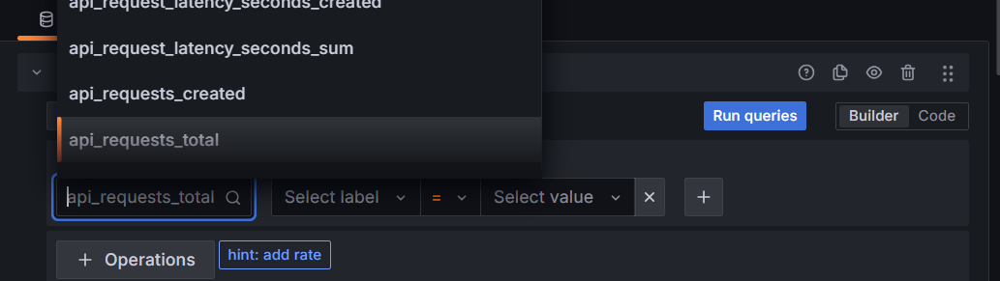
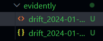

# Rapport TP5 - Monitoring et observabilité

---

## Exercice 1 - Démarrer la stack

## Exercice 2 - Instrumentation de FastAPI

L’histogramme de latence fournit une distribution complète des temps de réponse, permettant de visualiser non seulement la moyenne mais aussi les queues et les pics de latence. Une simple moyenne masquerait ces anomalies et ne montrerait pas les retards exceptionnels qui peuvent impacter l’expérience utilisateur. L’histogramme est donc plus utile pour détecter les lenteurs ponctuelles ou les changements de performance.

## Exercice 3 - Exploration de Prometheus

## Exercice 4 - Setup de Grafana

Ces métriques détectent efficacement la charge et le volume de trafic sur l’API, ainsi que les anomalies dans le temps de réponse et le nombre de requêtes. Elles ne permettent pas de mesurer directement la qualité des prédictions du modèle ou la précision des résultats. Par exemple, un pic de trafic sera visible, mais si le modèle se trompe systématiquement, cela ne sera pas détecté par Grafana.

## Exercice 5 - Drift Detection avec Evidently

Dans ce projet, Covariate drift correspond à un changement dans la distribution des features entre le jeu de référence et le jeu courant. Target drift correspond à un changement dans la distribution de la variable cible (ce que le modèle doit prédire) entre le jeu de référence et le jeu courant.

