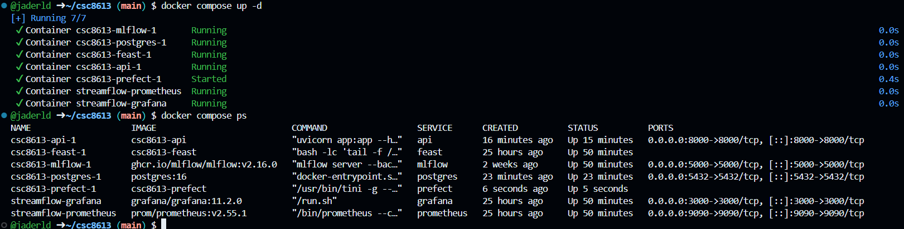
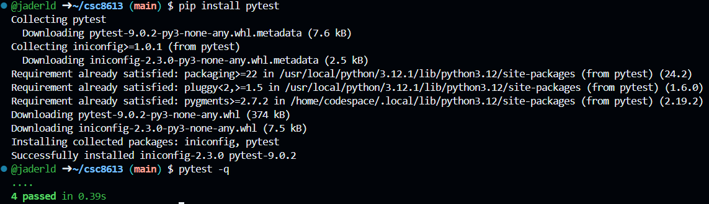
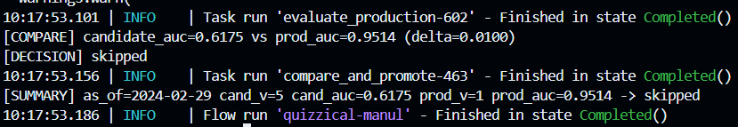
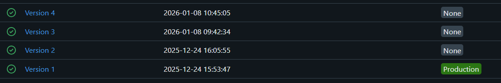
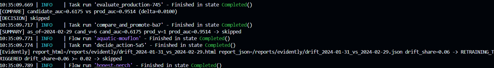
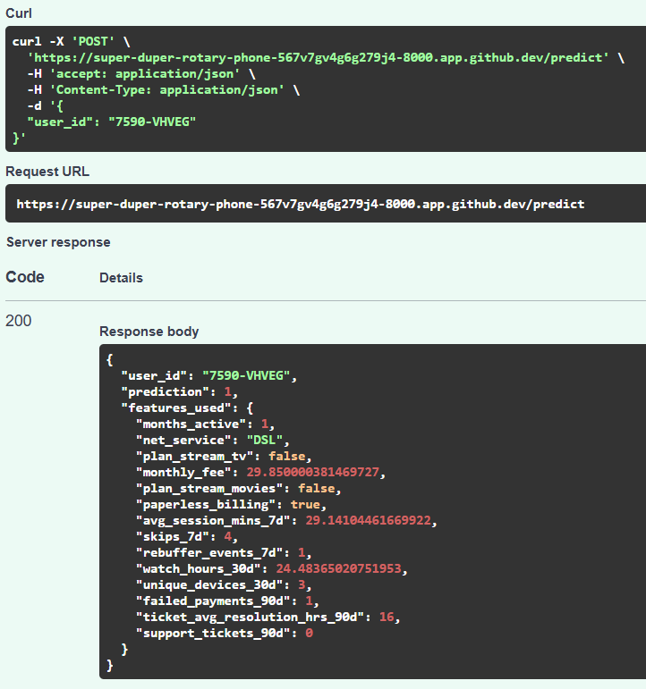

# Rapport TP6

## Exercice 1 - Mise en place du rapport

## Exercice 2 - Ajouter une logique de détection testable

Extraire une fonction pure comme should_promote permet de tester la logique de décision indépendamment de Prefect ou MLflow. Cela rend les tests unitaires simples, rapides et fiables, sans dépendre de services externes ou de l’état du pipeline complet.

## Exercice 3 - Créer le flow train_and_compare_flow

La version 4 a été créée suite à l'exécution.

## Exercice 4 - Connecter Drift

## Exercice 5 - Redémarrage API pour charger le nouveau modèle

L’API charge le modèle MLflow depuis l’URI models:/streamflow_churn/Production uniquement au démarrage. Si une nouvelle version du modèle est promue en Production, l’API doit être redémarrée pour recharger cette version et servir les prédictions avec le modèle à jour.

## Exercice 6 - CI GitHub Actions

