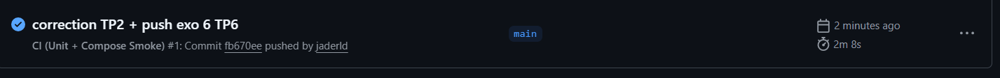

# Rapport TP6

## Exercice 1 - Mise en place du rapport

## Exercice 2 - Ajouter une logique de détection testable

Extraire une fonction pure comme should_promote permet de tester la logique de décision indépendamment de Prefect ou MLflow. Cela rend les tests unitaires simples, rapides et fiables, sans dépendre de services externes ou de l’état du pipeline complet.

## Exercice 3 - Créer le flow train_and_compare_flow

La version 4 a été créée suite à l'exécution.

## Exercice 4 - Connecter Drift

## Exercice 5 - Redémarrage API pour charger le nouveau modèle

L’API charge le modèle MLflow depuis l’URI models:/streamflow_churn/Production uniquement au démarrage. Si une nouvelle version du modèle est promue en Production, l’API doit être redémarrée pour recharger cette version et servir les prédictions avec le modèle à jour.

## Exercice 6 - CI GitHub Actions

(J'ai corrigé un souci de snapshot relatif au TP2, d'où le message du commit)

On démarre Docker Compose dans la CI pour effectuer des tests d’intégration multi-services, afin de vérifier que les services interagissent correctement et que l’API est joignable après build et démarrage.

## Exercice 7 - Synthèse finale

Dans ce projet, le drift des données est détecté en comparant les distributions des features et des labels entre un mois de référence et le mois courant, ce à l’aide d’Evidently. L’indicateur `drift_share` quantifie la proportion de colonnes dont la distribution a significativement changé.

Dans ce TP, un seuil de déclenchement fixé à 0.02 est utilisé pour forcer le réentraînement, alors qu’en production, ce seuil serait plus élevé afin d’éviter des réentraînements inutiles. Lorsque le drift mesuré dépasse ce seuil, le flow `train_and_compare_flow` est déclenché : il entraîne le modèle sur les nouvelles données, évalue la performance sur l’ensemble de validation et décide de promouvoir le modèle en Production si la performance est améliorée.

Prefect se charge de l’orchestration du pipeline complet. Il récupère les entités et les features via Feast, calcule le drift/target drift, déclenche l’entraînement et promeut du modèle si les conditions sont remplies.

GitHub Actions s’occupe de la CI. Il exécute es tests unitaires et vérifie que la stack multi-services (Postgres, Feast, MLflow, API) démarre correctement.

### Limites et axes d’amélioration
La CI ne teste pas la qualité finale du modèle ni l’entraînement complet pour plusieurs raisons : temps d’exécution très long, non-déterminisme / variabilité, ressources coûteuses. La CI sert à valider le code et l’intégration des services rapidement et de façon fiable, l'entraînement et l’évaluation complète sont réservés à des environnements dédiés (staging ou production) où le temps et les ressources sont prévus.

Certains tests d’intégration manquent, par exemple la cohérence des features ou la robustesse des prédictions sur des batches d’utilisateurs.

Enfin, en production, une approbation humaine et un suivi de gouvernance sont souvent nécessaires pour s’assurer que le modèle promu ne dégrade pas le service ou n’introduit pas de biais non détectés.